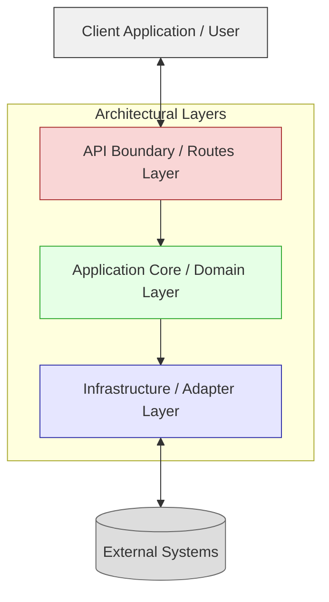
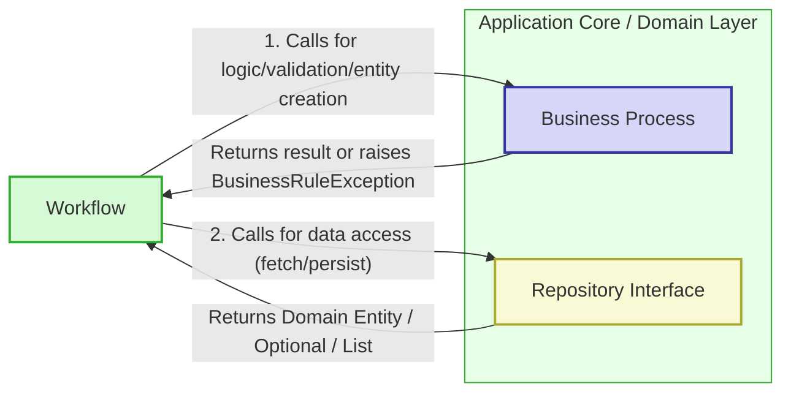

# Application Architecture Guide

## 1. Introduction & Philosophy

This guide defines the architectural standards for building our backend API applications. Our core philosophy balances **development velocity** with **long-term application health**, ensuring we can build quickly while creating systems that are maintainable, testable, and performant.

**Guiding Principles:**

1.  **Simplicity First:** Avoid complexity unless necessary and justified. Start with the simplest solution that works and evolve iteratively.
2.  **Pragmatism over Hype:** Favor proven, "boring" technologies with strong ecosystems. New tech requires focused PoCs and ADRs (Architecture Decision Records) before adoption.
3.  **Performance is Non-Negotiable:** Applications must be responsive ("snappy"). Performance is considered from design through deployment. Optimize application code and database interactions first.
4.  **Evolutionary Design:** Build systems that can adapt. Our chosen architecture facilitates future changes, like decomposing modules into services, without mandating premature distribution.
5.  **Testability is Foundational:** Design for ease of testing at all levels (unit, integration, API/E2E). Our architecture explicitly supports this.
6.  **Consistency is Key:** Adherence to the defined structure, patterns, and naming conventions is crucial for predictability and maintainability.
7.  **Clear Separation of Concerns (SoC):** Different parts of the application have distinct responsibilities, minimizing coupling and maximizing cohesion.
8.  **Dependency Inversion:** High-level modules depend on abstractions (interfaces), not concrete implementations, promoting flexibility.
9.  **Integrated Documentation:** Documentation (`/docs`) lives with the code, is versioned, uses practical diagrams (Mermaid), and includes ADRs for significant decisions or deviations.

## 2. Core Architecture: Modular Monolith

-   **Definition:** A single deployment unit (monolith) internally structured into distinct, well-encapsulated modules. Each module ideally represents a specific business capability or domain (e.g., `employees`, `timesheets`, `invoices`).
-   **Rationale:**
    *   Maximizes initial development speed (reduced distributed systems overhead: network latency, deployment complexity, distributed transactions).
    *   Simplifies initial operations, monitoring, and local development setup.
    *   Allows easy code sharing via internal libraries/core modules.
    *   Provides flexibility: Well-defined module boundaries and interfaces allow for future extraction into separate services if driven by concrete needs (e.g., team structure, independent scaling requirements, differing technology needs). This extraction is facilitated by the clear internal architecture.
-   **Key Characteristics:**
    *   **High Cohesion:** Components within a module are strongly related.
    *   **Low Coupling:** Modules minimize dependencies on each other, interacting through well-defined interfaces (API Layers, Workflow Layers, potentially shared libraries).

## 3. Layered Architecture - The Core Pattern

To ensure Separation of Concerns, Testability, and Maintainability, all backend implementations **MUST** follow this five-layer architecture pattern.

**3.1. High-Level Overview:**

This diagram shows the main layers and their dependencies:



**3.2. The Five Layers Defined:**

1.  **Routes Layer (`app/api/routes/`)**
    *   **Purpose:** Handles incoming HTTP requests and outgoing HTTP responses. Acts as the interface to the outside world.
    *   **Responsibilities:**
        *   Define API endpoints (paths, methods) using FastAPI `APIRouter`.
        *   Define and use Pydantic schemas (`app/schemas/`) for request validation (body, query/path parameters) and response serialization.
        *   Handle authentication and potentially basic authorization checks (often via FastAPI dependencies).
        *   Extract data from the request.
        *   Use Dependency Injection (`app/api/deps.py`) to obtain an instance of the appropriate **Workflow** component.
        *   Call a *single* method on the injected Workflow instance, passing validated data.
        *   Map the successful result (often a Domain Entity) from the Workflow layer to the appropriate Pydantic response schema.
        *   **NO business logic or orchestration logic resides here.**

2.  **Workflow Layer (`app/domain/workflows/`)**
    *   **Purpose:** Orchestrates application use cases. This layer defines *how* the application achieves a specific goal requested via an API endpoint. It coordinates interactions between domain logic and infrastructure access.
    *   **Responsibilities:**
        *   Define methods representing application use cases (e.g., `create_new_employee`, `submit_timesheet`).
        *   Inject dependencies via `__init__` (typically Business Process components, Repository Interfaces, and other Adapter Interfaces).
        *   Call methods on **Business Process** components to execute pure domain logic, perform complex validations, or create/manipulate domain entities.
        *   Call methods on **Repository Interfaces** to request data fetching or persistence operations.
        *   Call methods on other **Adapter Interfaces** (e.g., `TaskQueueAdapter`, `FileStorageAdapter`, `PaymentGatewayAdapter`) to interact with external systems or trigger background tasks.
        *   May call methods on *other Workflows* to reuse or decompose complex orchestration logic.
        *   Implement transaction boundaries if a use case involves multiple data-modifying steps that must succeed or fail together (using `DatabaseAdapter.transaction()`).
        *   Contain **Application Logic** (orchestration, sequencing calls) but **NOT core Domain Logic**.
        *   Raise specific, custom application exceptions (`app/core/exceptions.py`) on failure (e.g., `NotFoundException`, `AuthorizationException`).
        *   Return results (often Domain Entities or simple types) back to the Routes layer. **Does NOT handle HTTP specifics.**

3.  **Business Process Layer (`app/domain/business_process/`)**
    *   **Purpose:** Encapsulates pure, domain-specific business logic, rules, calculations, and validations. This is the heart of the domain model's behavior.
    *   **Responsibilities:**
        *   Contain methods or functions representing core business rules (e.g., `validate_timesheet_hours`, `calculate_employee_leave_balance`, `is_valid_status_transition`).
        *   Operate primarily on Domain Entities (`app/domain/entities/`) and primitive types.
        *   Perform complex validations beyond simple type checks (which are handled by schemas).
        *   May create or update the state of Domain Entities according to business rules.
        *   **MUST NOT contain any I/O operations** (no database calls, no external API calls, no file system access).
        *   **MUST NOT have dependencies on Repositories or Adapters.**
        *   Raise `BusinessRuleException` or more specific custom domain exceptions on validation failures or rule violations.
        *   Return results (e.g., calculated values, validated/updated entities) to the Workflow layer.
        *   This layer is highly cohesive, testable in isolation, and reusable across different workflows.

4.  **Repository Layer (Interface) (`app/domain/interfaces/`)**
    *   **Purpose:** Defines the contract (interface) for data access operations for a specific Domain Entity or aggregate. It abstracts *how* data is persisted or retrieved.
    *   **Responsibilities:**
        *   Define an Abstract Base Class (ABC) for each primary Domain Entity requiring persistence (e.g., `EmployeeRepository`, `TimesheetRepository`).
        *   Define `async` methods representing data operations (e.g., `create`, `get_by_id`, `find_by_email`, `list_all_active`, `update_status`).
        *   Method signatures accept and return Domain Entities (`app/domain/entities/`) or primitive types/collections thereof (e.g., `Optional[Employee]`, `List[Timesheet]`, `int`).
        *   **MUST NOT expose any details about the underlying storage mechanism** (no SQL fragments, no specific DB connection objects). It defines *what* data operations are needed, not *how* they are performed.

5.  **Adapter Layer (`app/infrastructure/`)**
    *   **Purpose:** Provides concrete implementations for interfaces defined in the Domain or Core layers and handles all interactions with external systems and infrastructure concerns.
    *   **Responsibilities:**
        *   **Repository Implementations (`app/infrastructure/repositories/`)**:
            *   Implement the corresponding Repository interfaces (e.g., `SQLEmployeeRepository(EmployeeRepository)`).
            *   Inject and use a specific infrastructure adapter (e.g., `DatabaseAdapter`) to perform the actual I/O.
            *   Translate domain operations into infrastructure-specific actions (e.g., writing **parameterized SQL queries** for `asyncpg`).
            *   Map data between Domain Entities and the infrastructure format (e.g., database rows/records).
            *   Handle infrastructure-specific errors (e.g., database connection errors, unique constraint violations), potentially wrapping them in custom application exceptions (e.g., `DatabaseException`).
            *   Contain **ONLY data mapping and infrastructure interaction logic. NO business logic.**
        *   **Infrastructure Adapters (`app/infrastructure/adapters/`)**:
            *   Implement core or domain interfaces for interacting with external systems (`DatabaseAdapter`, `CacheAdapter`, `TaskQueueAdapter`, `FileStorageAdapter`, `PaymentGatewayAdapter`, etc.).
            *   Encapsulate the specific details of using a driver, SDK, or HTTP client (`asyncpg`, `boto3`, `httpx`, `celery`, `redis-py`).
            *   Manage connections, authentication, serialization/deserialization specific to the external system.
            *   Located in subdirectories (e.g., `db/`, `cache/`, `queues/`, `storage/`, `payments/`).

**3.3. Interaction Flow & Rationale:**

This diagram illustrates the primary flow for a typical request involving data access and business logic:



*   **Key Interaction:** The **Workflow Layer** is the central orchestrator. It calls the **Business Process Layer** for pure domain logic/validation and directly calls methods defined on **Repository Interfaces** for data operations.
*   **Rationale (BP Purity):** This pattern is chosen specifically to keep the **Business Process Layer absolutely pure** and free from I/O concerns. This makes domain logic highly testable, reusable, and independent of infrastructure details.
*   **Application vs. Domain Logic:**
    *   **Domain Logic (in BP):** Core rules of the business (e.g., "Is this email valid?", "Calculate tax"). Knows nothing about databases or use cases.
    *   **Application Logic (in Workflow):** Orchestration logic for a specific use case (e.g., "To create an employee: first call BP to validate and create entity, then call Repo to save it"). Knows the sequence and coordinates calls to BP and Repositories/Adapters.

**3.4. Handling External Systems:**

External systems (Queues, Caches, 3rd Party APIs, File Storage, etc.) are accessed via the Adapter Layer, orchestrated typically by the Workflow Layer.

```mermaid
flowchart TD
    RI[Repository Interface]
    WF[Workflow]

    subgraph InfraLayer["Infrastructure / Adapter Layer"]
        RImpl[Repository Implementation]
        DA[Database Adapter]
        OTH[Other Adapters (Queue, Cache, API, Storage...)]
        OTH_I[Other Interfaces (Core/Domain)]
    end

    DB[(Database)]
    EXT[(External Systems)]

    RImpl -->|"implements"| RI
    RImpl -->|"uses"| DA
    DA -->|"SQL"| DB
    WF -->|"calls"| OTH
    OTH -->|"interacts"| EXT
    OTH -->|"implements"| OTH_I

    classDef workflow fill:#d6f9d6,stroke:#3a3,stroke-width:2px
    classDef repo fill:#f9f9d6,stroke:#aa3,stroke-width:2px
    classDef adapter fill:#f9d6f9,stroke:#a3a,stroke-width:2px
    classDef external fill:#ddd,stroke:#666,stroke-width:1px
    classDef infra fill:#e6e6ff,stroke:#33a,stroke-width:1px

    class WF workflow
    class RI,RImpl repo
    class DA,OTH,OTH_I adapter
    class DB,EXT external
    class InfraLayer infra
```

*   Define an **Interface** (e.g., `TaskQueueAdapter`, `FileStorageAdapter`) in `app/core/interfaces.py` or `app/domain/interfaces/`.
*   Implement the interface in `app/infrastructure/adapters/` using the specific library/SDK (e.g., `CeleryTaskQueueAdapter`, `S3FileStorageAdapter`).
*   Inject the **Interface** into the **Workflow** layer.
*   The Workflow calls methods on the interface to enqueue tasks, upload files, call external APIs, etc.

## 4. Data Handling: Entities & Schemas

*   **Domain Entities (`app/domain/entities/`)**:
    *   Represent core business concepts (e.g., `Employee`, `Timesheet`).
    *   Typically implemented as simple `dataclasses` or Pydantic `BaseModel`s.
    *   May contain methods representing intrinsic entity behavior (rich domain model), but logic involving multiple entities or complex rules usually resides in the BP layer.
    *   Used internally by Workflow, Business Process, and Repository layers.
    *   **MUST NOT** be directly exposed by the API Layer. Use the `_entity.py` filename suffix. Use simple class names (e.g., `class Employee:`).
*   **API Schemas (`app/schemas/`)**:
    *   Define the data contract for API requests and responses.
    *   **MUST** use Pydantic `BaseModel`. Define Python `Enum` subclasses for status fields etc.
    *   Used **ONLY** in the Routes Layer for validation and serialization.
    *   Explicit mapping between Entities and Schemas occurs in the Routes Layer (e.g., `EmployeeReadSchema.model_validate(employee_entity)`) or sometimes in the Workflow for complex cases (though returning entities is preferred). Use clear names like `EmployeeCreateSchema`, `EmployeeReadSchema`, `EmployeeUpdateSchema`.

## 5. Data Persistence: Repository Pattern & Direct SQL

*   **Repository Pattern:** All data access **MUST** go through Repository Interfaces defined in the domain layer (`app/domain/interfaces/`). Concrete implementations (`app/infrastructure/repositories/`) use the `DatabaseAdapter`. This decouples the application core from the database specifics.
*   **Direct SQL (No ORM):** We standardize on direct SQL execution via `asyncpg` for maximum performance control and to avoid ORM complexity/overhead. ORM usage requires an ADR.
*   **Database Adapter (`app/infrastructure/adapters/db/postgres.py`):** A dedicated adapter implementing `DatabaseAdapter` interface handles `asyncpg` connection pooling, query execution (`fetch_one`, `fetch_all`, `execute`), and transaction management.
*   **Parameterized Queries:** **MANDATORY** for all SQL execution within Repository implementations to prevent SQL injection vulnerabilities. Use `$1`, `$2`, etc., placeholders passed to `asyncpg` methods. **NEVER use string formatting/interpolation for query parameters.**

## 6. Error Handling

*   **Custom Exceptions:** Define specific, custom exception classes (inheriting from `ApplicationException`) in `app/core/exceptions.py` (e.g., `NotFoundException`, `BusinessRuleException`, `DatabaseException`, `AuthorizationException`). Lower layers (BP, Repo Impl, Adapters, Workflow) should raise these meaningful exceptions.
*   **Exception Propagation:** Exceptions raised in lower layers are generally allowed to propagate upwards.
*   **Global Exception Handlers:** The primary mechanism for converting application exceptions into HTTP responses is via **Global Exception Handlers** defined in `app/api/error_handlers.py` and registered with the FastAPI app instance in `app/main.py`. These handlers catch specific custom exceptions (or base `ApplicationException`) and return appropriate `JSONResponse` objects with correct status codes and detail messages.
*   **Router Responsibility:** Routers ideally do *not* contain extensive `try...except` blocks for application errors; they rely on the exceptions propagating to the global handlers.

```mermaid
flowchart LR
    subgraph Components
        BP[Business Process] -->|"BusinessRuleException"| EH
        WF[Workflow] -->|"Unhandled exceptions"| EH
        RImpl[Repository Implementation / Adapter] -->|"Database/External Exception"| WF # Propagates up
    end

    EH[Global Exception Handlers]
    U[Client Application / User]

    EH -->|"HTTP Error Response (e.g., 400, 404, 500)"| U

    classDef handler fill:#ffe4e1,stroke:#a33,stroke-width:1px
    EH handler
```

## 7. Technology Stack (Primary)

*   **Language:** Python 3.11+
*   **Framework:** FastAPI
*   **ASGI Server:** Uvicorn (Dev) / Gunicorn + Uvicorn workers (Prod)
*   **Data Validation/Serialization:** Pydantic v2
*   **Database:** PostgreSQL (Latest Stable)
*   **DB Driver:** `asyncpg` (Direct SQL via `DatabaseAdapter` only)
*   **DI:** FastAPI `Depends`
*   **Testing:** `pytest`, `pytest-asyncio`, FastAPI `TestClient`, `httpx`, `pytest-cov`, `factory-boy`
*   **Dependency Mgmt:** Poetry
*   **Lint/Format:** Black, Flake8 (+ plugins like bugbear, comprehensions), isort, MyPy
*   **Hooks:** `pre-commit` enforcing linters/formatters.
*   **Async:** All I/O operations (DB, external APIs, etc.) **MUST** be `async`/`await`.

*(Alternative stacks like Node.js/TypeScript/Fastify exist but require adherence to the same 5-layer principles and direct SQL access, justified via ADR).*

## 8. Code Structure & Naming Conventions

**8.1. Canonical Directory Structure (Root Level):**

```
.
├── app/
│   ├── api/
│   │   ├── deps.py
│   │   ├── error_handlers.py
│   │   └── routes/
│   │       └── __init__.py # + employee_router.py, etc.
│   ├── core/
│   │   ├── config.py
│   │   ├── exceptions.py
│   │   └── interfaces.py # Core adapter interfaces (DatabaseAdapter, etc)
│   ├── domain/
│   │   ├── business_process/
│   │   │   └── __init__.py # + employee_bp.py, etc.
│   │   ├── entities/
│   │   │   └── __init__.py # + employee_entity.py, etc.
│   │   ├── interfaces/
│   │   │   └── __init__.py # + employee_repository.py, etc. (Repo ABCs)
│   │   └── workflows/
│   │       └── __init__.py # + employee_workflow.py, etc.
│   ├── infrastructure/
│   │   ├── adapters/
│   │   │   ├── db/
│   │   │   │   └── postgres.py
│   │   │   ├── cache/
│   │   │   └── queues/ # etc.
│   │   └── repositories/
│   │       └── __init__.py # + sql_employee_repository.py, etc.
│   ├── schemas/
│   │   └── __init__.py # + employee_schema.py, etc.
│   └── main.py
├── docs/
│   ├── adrs/
│   ├── diagrams/
│   └── ...
├── scripts/
│   └── sql/ # For manual schema scripts
├── tests/
│   ├── api/
│   ├── factories/
│   ├── integration/
│   │   └── infrastructure/
│   │       └── repositories/
│   └── unit/
│       ├── core/
│       └── domain/
│           ├── business_process/
│           └── workflows/
├── .env.example
├── .gitignore
├── .pre-commit-config.yaml
├── pyproject.toml
├── poetry.lock
└── README.md
```

**8.2. Naming Conventions:**

*   **Files/Dirs:** `snake_case`
*   **Classes/Interfaces/Enums:** `PascalCase`
    *   Workflow: `EmployeeWorkflow`
    *   Business Process: `EmployeeBusinessProcess`
    *   Repo Interface: `EmployeeRepository` (ABC)
    *   Repo Impl: `SQLEmployeeRepository`
    *   Adapter: `PostgresAdapter`, `S3StorageAdapter`
    *   Entity: `Employee` (simple name)
    *   Schema: `EmployeeCreateSchema`, `EmployeeReadSchema`, `EmploymentStatusEnum`
    *   Exception: `NotFoundException`
*   **Methods/Functions/Variables:** `snake_case`
*   **Filename Suffixes:** `_router.py`, `_workflow.py`, `_bp.py`, `_repository.py` (interface), `sql_..._repository.py` (impl), `_entity.py`, `_schema.py`, `test_... .py`.

## 9. Prescribed TDD Workflow

Development **MUST** follow this Test-Driven Development cycle for features involving multiple layers:

1.  **API Test (Fail):** Write `test_..._router.py` using `TestClient`. Test success (2xx, response schema) and key error cases (4xx). Fails (404/500).
2.  **Route Implementation (Minimal):** Create route (`..._router.py`), define schemas (`..._schema.py`), inject Workflow (`deps.py`), call placeholder workflow method. Fails (DI/NotImplemented).
3.  **Workflow Unit Test (Fail):** Create `test_..._workflow.py`. Mock Repo Interface & BP class. Test workflow logic, asserting mocks are called correctly. Fails (NotImplemented).
4.  **Workflow Implementation:** Implement workflow logic (`..._workflow.py`), calling mockable BP/Repo interface methods. Pass workflow unit tests. API test likely still fails (DI/Repo Impl).
5.  **Business Process Unit Test (Fail - if new logic):** Create `test_..._bp.py`. Test pure domain logic/validation without mocks. Fails (NotImplemented).
6.  **Business Process Implementation:** Implement BP logic (`..._bp.py`). Pass BP unit tests.
7.  **Repository Integration Test (Fail):** Create `test_sql_..._repository.py`. Use a real test DB fixture (`test_db_session`). Instantiate SQL Repo Impl with test adapter. Call repo method. Assert entity state and query DB directly to verify persistence/retrieval. Fails (NotImplemented/DB error).
8.  **Repository Implementation:** Implement SQL Repo method (`sql_..._repository.py`) using `DatabaseAdapter` and parameterized SQL. Implement `_map_row_to_entity`. Pass repo integration tests.
9.  **Wire Dependencies:** Ensure `deps.py` correctly provides the concrete implementations (SQL Repo, BP) when injecting interfaces (Repo Interface) into the Workflow.
10. **Run API Test (Pass):** Re-run initial API test. It must pass, exercising the full stack.
11. **Refactor:** Clean up code and tests while keeping all tests passing.

## 10. Supporting Principles (Briefly)

*   **Performance:** Prioritize efficient `async` code, database query tuning (`EXPLAIN ANALYZE`), appropriate indexing. Use application-level caching cautiously *after* optimizing code/DB (Section 7 of original guide).
*   **Security:** Use Pydantic for input validation. **MANDATORY Parameterized Queries** are the primary defense against SQL Injection. Use standard JWT/OAuth2 via Adapters. Scan dependencies. Manage secrets via env vars (`.env`) and secure secret stores in deployment. Enforce HTTPS. Implement rate limiting. (Section 10 of original guide).
*   **Deployment:** Target Docker containers. Use Environment Variables exclusively for configuration (loaded via `pydantic-settings`).
*   **Dev Process:** Use Git (GitHub Flow recommended), mandatory PRs/Code Reviews, `pre-commit` hooks for local checks, CI/CD pipeline for automated testing/builds/deployments.
*   **Documentation:** Maintain living documentation in `/docs` (incl. ADRs for deviations), use Mermaid diagrams.

## 11. Evolution Strategy

The Modular Monolith structure and clear layering facilitate future evolution. If a module needs to be extracted into a separate service (due to scaling needs, team structure, etc.), the Workflow Layer often defines the initial contract/API boundary for the new service. Avoid premature decomposition.

---
