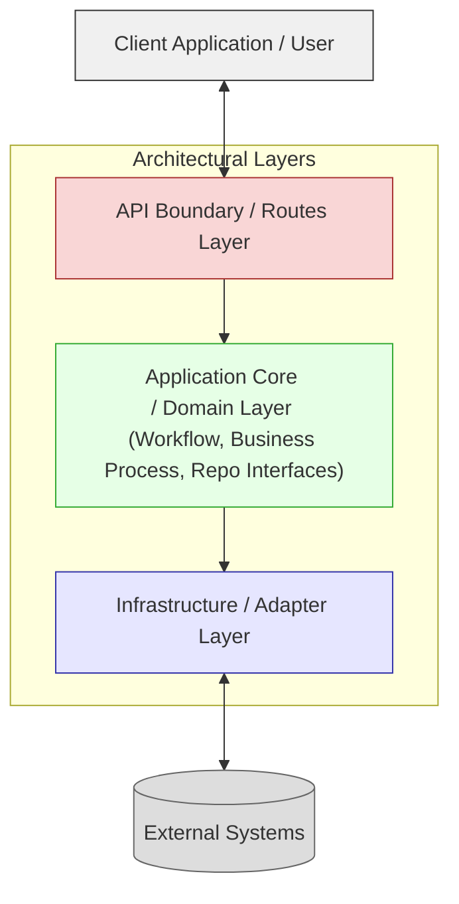
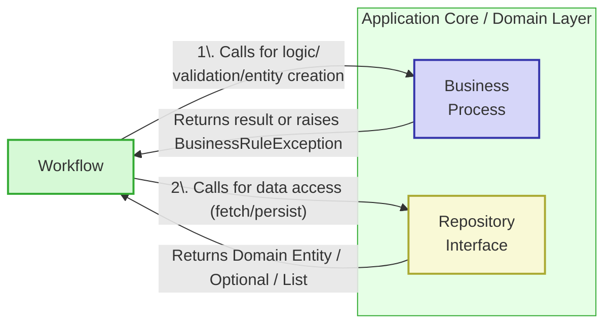
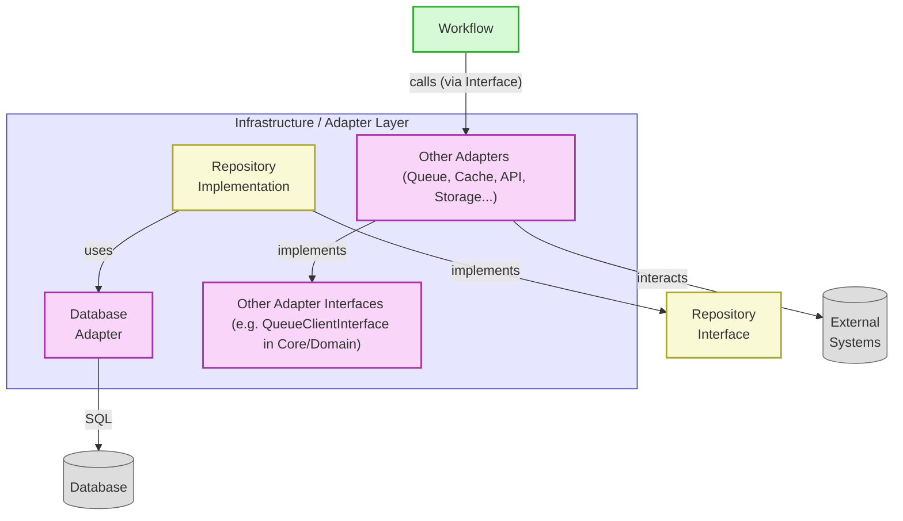
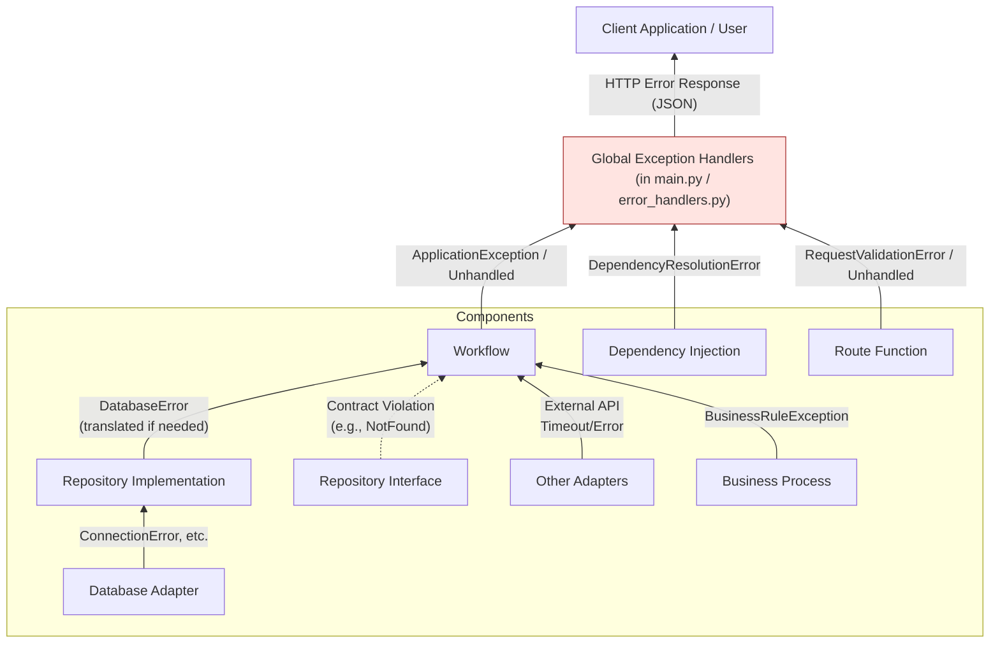

# Application Architecture Guide (v2.4)

## Executive Summary!

This guide outlines the architectural standards for our backend API applications, emphasizing a balance between **development velocity** and **long-term application health**. Key tenets include **Simplicity First**, **Pragmatism over Hype**, and **Performance is Non-Negotiable**.

We adopt a **Modular Monolith** architecture, structured internally into distinct modules representing business capabilities. This approach offers initial speed and simplified operations while allowing for future evolution towards microservices if needed. A mandatory **Five-Layer Architecture** (Routes, Workflow, Business Process, Repository Interface, Adapter) ensures Clear Separation of Concerns, Testability, and Maintainability.

Data access is standardized on **Direct SQL** (via `asyncpg` and a `DatabaseAdapter`) within a Repository Pattern, prioritizing performance and control. Test-Driven Development (TDD) is prescribed, with a detailed workflow. The primary technology stack is Python/FastAPI, with specific tooling for linting, testing, and dependency management. Consistent naming conventions, directory structure, and adherence to cross-cutting concerns like security, logging, and documentation (including ADRs) are crucial.

## 1. Introduction & Philosophy

This guide defines the architectural standards for building our backend API applications. Our core philosophy balances **development velocity** with **long-term application health**, ensuring we can build quickly while creating systems that are maintainable, testable, and performant.

**Guiding Principles:**

1.  **Simplicity First:** Avoid complexity unless necessary and justified. Start with the simplest solution that works and evolve iteratively.
2.  **Pragmatism over Hype:** Favor proven, "boring" technologies with strong ecosystems. New tech requires focused PoCs and ADRs (Architecture Decision Records) before adoption.
3.  **Performance is Non-Negotiable:** Applications must be responsive ("snappy"). Performance is considered from design through deployment. Optimize application code and database interactions first.
4.  **Evolutionary Design:** Build systems that can adapt. Our chosen architecture facilitates future changes, like decomposing modules into services, without mandating premature distribution.
5.  **Testability is Foundational:** Design for ease of testing at all levels (unit, integration, API/E2E). Our architecture explicitly supports this.
6.  **Consistency is Key:** Adherence to the defined structure, patterns, and naming conventions is crucial for predictability and maintainability.
7.  **Clear Separation of Concerns (SoC):** Different parts of the application have distinct responsibilities, minimizing coupling and maximizing cohesion.
8.  **Dependency Inversion:** High-level modules depend on abstractions (interfaces), not concrete implementations, promoting flexibility.
9.  **Integrated Documentation:** Documentation (`/docs`) lives with the code, is versioned, uses practical diagrams (Mermaid), and includes ADRs for significant decisions or deviations.

## 2. Core Architecture: Modular Monolith

-   **Definition:** A single deployment unit (monolith) internally structured into distinct, well-encapsulated modules. Each module ideally represents a specific business capability or domain (e.g., `employees`, `timesheets`, `invoices`).
-   **Rationale:**
    *   Maximizes initial development speed (reduced distributed systems overhead: network latency, deployment complexity, distributed transactions).
    *   Simplifies initial operations, monitoring, and local development setup.
    *   Allows easy code sharing via internal libraries/core modules (e.g., common utilities in `app/common/`).
    *   Provides flexibility: Well-defined module boundaries and interfaces allow for future extraction into separate services if driven by concrete needs (e.g., team structure, independent scaling requirements, differing technology needs). This extraction is facilitated by the clear internal architecture.
-   **Key Characteristics:**
    *   **High Cohesion:** Components within a module are strongly related.
    *   **Low Coupling:** Modules minimize dependencies on each other, interacting through well-defined interfaces (primarily their Workflow Layers, or clearly defined Module Interface Layers, potentially shared libraries).

## 3. Architecture Choice: Modular Monolith vs. Microservices

A common alternative architecture is Microservices, where the application is decomposed into multiple independently deployable services, each managing its own data and communicating over a network. While powerful for large, complex systems with independent scaling needs, we have deliberately chosen the **Modular Monolith** approach for our standard architecture.

**3.1. Comparison:**

| Feature                 | Modular Monolith (Our Approach)                                    | Microservices Architecture                                      |
| :---------------------- | :----------------------------------------------------------------- | :-------------------------------------------------------------- |
| **Deployment Unit**     | Single Application                                                 | Multiple Independent Services                                   |
| **Codebase**            | Single Repository (typically)                                      | Multiple Repositories (typically)                               |
| **Data Management**     | Single Database (typically, with schemas per module)               | Each service owns its own database/schema                     |
| **Communication**       | Internal Function/Method Calls                                     | Network Calls (REST, gRPC, Messaging Queues)                  |
| **Transactions**        | Local DB Transactions                                              | Distributed Transactions (complex: Sagas, 2PC - often avoided) |
| **Initial Complexity**  | **Lower** (less infrastructure overhead, simpler local dev)        | **Higher** (requires robust CI/CD, service discovery, IPC)     |
| **Operational Overhead**| **Lower** (fewer moving parts to monitor, deploy, manage)         | **Higher** (monitoring, logging, tracing across services)       |
| **Development Velocity**| **Higher Initially** (less coordination, simpler changes)          | Can be higher *at scale* with independent teams, but slower start |
| **Scalability**         | Scale the entire monolith; DB can be bottleneck                  | Scale individual services independently                         |
| **Technology Diversity**| Limited (single stack usually)                                   | High (each service can use different tech - a benefit & cost) |
| **Fault Isolation**     | Lower (error in one module *can* affect others)                    | Higher (failure in one service less likely to cascade directly) |
| **Team Structure**      | Suited for smaller/medium teams or teams working cross-functionally| Suited for larger orgs with teams aligned to specific services |

**3.2. Rationale for Choosing Modular Monolith:**

Based on our guiding principles (**Simplicity First, Pragmatism**) and typical project scope, the Modular Monolith offers significant advantages, particularly in the early-to-mid stages of an application's lifecycle:

1.  **Reduced Initial Complexity:** Avoids the significant upfront investment in infrastructure and tooling required for a robust microservices environment.
2.  **Faster Initial Development:** Direct method calls are simpler and faster than implementing and managing network communication.
3.  **Simplified Operations:** Monitoring, logging, deployment, and local development setup are considerably simpler.
4.  **Easier Transaction Management:** Standard atomic database transactions handle data consistency.
5.  **Sufficient Scalability (Initially):** Vertical or horizontal scaling alongside database optimizations provides adequate performance for many applications.

**3.3. Evolution Path to Microservices (When Needed):**

Our **Layered Architecture** and **Modular Monolith** approach are explicitly designed to *facilitate* future decomposition into microservices *if and when concrete needs arise*.

**How this architecture enables the transition:**

1.  **Well-Defined Module Boundaries:** Internal structure by business capability provides natural seams.
2.  **Clear Interfaces (Workflow Layer):** Workflow methods often form the basis for a new microservice's API.
3.  **Repository Pattern:** Facilitates data ownership transfer.
4.  **Decoupling via Adapters:** External system interactions are already encapsulated.

**The Process (Conceptual):**

1.  **Identify Candidate Module:** Based on specific drivers (scaling, team, tech). Requires an **ADR**.
2.  **Define Service API.**
3.  **Extract Code.**
4.  **Data Migration/Isolation.**
5.  **Replace Internal Calls with Network Calls** (via new Adapters).
6.  **Deploy Independently.**
7.  **Consider Strangler Fig Pattern** for gradual migration if needed.

## 4. Layered Architecture - The Core Pattern

To ensure Separation of Concerns, Testability, and Maintainability, all backend implementations **MUST** follow this five-layer architecture pattern.

**4.1. High-Level Overview:**

This diagram shows the main architectural layers and their dependencies. The "Application Core / Domain Layer" is a conceptual grouping that includes the Workflow, Business Process, and Repository Interface layers.



**4.2. The Five Layers Defined:**

1.  **Routes Layer (`app/api/routes/`)**
    *   **Purpose:** Handles incoming HTTP requests and outgoing HTTP responses. Interface to the outside world.
    *   **Responsibilities:** Define endpoints, validate/serialize request/response schemas (`app/schemas/`), handle authentication, use DI (`app/api/deps.py`) to obtain a **Workflow** instance, call a *single* Workflow method, map results to response schemas. **NO business/orchestration logic.**

2.  **Workflow Layer (`app/domain/workflows/`)**
    *   **Purpose:** Orchestrates application use cases. Defines *how* the application achieves a goal by coordinating domain logic and infrastructure access.
    *   **Responsibilities:** Define use case methods. Inject & call **Business Process** components (for domain logic), **Repository Interfaces** (for data access), and **Adapter Interfaces** (for external systems/tasks). May call other Workflows (from other modules). Manages transactions (e.g., using a database transaction context manager provided by the `DatabaseAdapter`). Contains **Application Logic**, NOT core **Domain Logic**. Raises application-specific exceptions. Returns results (e.g., Domain Entities) to the Routes Layer.

3.  **Business Process Layer (`app/domain/business_process/`)**
    *   **Purpose:** Encapsulates pure, domain-specific business logic, rules, calculations, and state changes of Domain Entities.
    *   **Responsibilities:** Contain core business rules. Operate on Domain Entities (`app/domain/entities/`). Perform complex validations. **MUST NOT contain I/O operations (database, network calls).** **MUST NOT depend directly on Repositories/Adapters.** Raise `BusinessRuleException` or similar domain-specific exceptions. Return results or modified entities to the Workflow Layer. Designed to be highly testable in isolation and reusable.

4.  **Repository Layer (Interface) (`app/domain/interfaces/`)**
    *   **Purpose:** Defines the contract (interface/Abstract Base Class) for data access operations for a specific Domain Entity or aggregate. Abstracts *how* data is persisted or retrieved.
    *   **Responsibilities:** Define ABCs (e.g., `EmployeeRepository` in `employee_repository.py`). Define `async` data operation methods (e.g., `create_employee`, `get_employee_by_id`). Accept/return Domain Entities or primitive types. **MUST NOT expose storage-specific details (e.g., SQL, table names).**

5.  **Adapter Layer (`app/infrastructure/`)**
    *   **Purpose:** Provides concrete implementations for interfaces defined in the domain or core layers. Handles all external system interactions (database, caches, message queues, third-party APIs, etc.).
    *   **Responsibilities:**
        *   **Repository Implementations (`app/infrastructure/repositories/`)**: Implement Repository interfaces (e.g., `SQLEmployeeRepository`). Use a specific `DatabaseAdapter`. Translate domain operations to infrastructure-specific actions (e.g., writing **parameterized SQL** queries). Map data between Domain Entities and the infrastructure's data format. Handle infrastructure-specific errors and translate them if necessary. **Contains ONLY data mapping and infrastructure interaction logic.**
        *   **Infrastructure Adapters (`app/infrastructure/adapters/`)**: Implement core infrastructure interfaces (e.g., `DatabaseAdapter`, `CacheAdapter` defined in `app/core/interfaces.py`) or other adapter interfaces. Encapsulate driver/SDK/client details (`asyncpg`, `boto3`, `httpx`, etc.). Manage connections, authentication with external systems, and serialization/deserialization for external communication.

**4.3. Interaction Flow & Rationale:**

This diagram illustrates the primary flow for fulfilling a use case:



*   **Key Interaction:** The Workflow orchestrates, calling the Business Process Layer for pure domain logic and Repository Interfaces for data operations.
*   **Rationale (BP Purity):** Keeping the Business Process Layer free from I/O makes its components highly testable in isolation and reusable across different use cases or even applications.
*   **Application vs. Domain Logic:** The Workflow Layer handles use case orchestration (application logic), while the Business Process Layer handles core domain rules (domain logic).

**4.4. Handling External Systems:**

External systems are accessed via Adapters, typically invoked by the Workflow Layer (or sometimes by other Adapters if one infrastructure component relies on another, e.g., a service that uses a cache).



*   **Process:**
    1.  Define an Interface for the external interaction (e.g., `EmailServiceInterface` in `app/domain/interfaces/` or a more generic `NotificationAdapterInterface` in `app/core/interfaces.py`).
    2.  Implement the concrete Adapter in `app/infrastructure/adapters/` using the specific library/SDK.
    3.  Inject the Interface into the Workflow (or other client component) via Dependency Injection.

## 5. Data Handling: Entities & Schemas

*   **Domain Entities (`app/domain/entities/`)**: Represent core business concepts (e.g., `Employee`). Typically Python `dataclasses` or Pydantic `BaseModel`s. Used internally by Workflow, Business Process, and Repository layers. **Not directly exposed by the API.** Use `_entity.py` suffix for filenames, simple class names (e.g., `class Employee:` in `employee_entity.py`).
*   **API Schemas (`app/schemas/`)**: Define the API request and response contracts. **MUST** use Pydantic `BaseModel`. Use Python `Enum`s for fixed choice fields. **ONLY used in the Routes Layer** for validation and serialization. Mappings between Domain Entities and API Schemas are performed explicitly in the Routes Layer. Use descriptive names like `EmployeeCreateSchema`, `EmployeeReadSchema`.

## 6. Data Persistence: Repository Pattern & Direct SQL

*   **Repository Pattern:** All data access **MUST** go through Repository Interfaces defined in `app/domain/interfaces/`. Concrete implementations reside in `app/infrastructure/repositories/` and use the `DatabaseAdapter`.
*   **Database Adapter (`app/infrastructure/adapters/db/postgres.py`):** Handles `asyncpg` connection pooling, query execution (`fetch_one`, `fetch_all`, `execute`), and provides mechanisms for transaction management (e.g., an async context manager for `BEGIN...COMMIT/ROLLBACK`).

**6.1. Rationale for Direct SQL over ORM:**

This specification standardizes on **direct SQL execution via `asyncpg`** for PostgreSQL interactions.

1.  **Performance Control (Principle #3):** Provides maximum transparency and control over database queries.
2.  **Leveraging Database Features:** Allows direct use of advanced PostgreSQL features.
3.  **Avoiding ORM Impedance Mismatch:** Prevents complexities from mapping object-oriented paradigms to relational databases.
4.  **Conceptual Simplicity (within this architecture):** Avoids adding another layer of abstraction (the ORM), relying on the Repository pattern for data access abstraction.

**Mitigating the Downsides:**

*   **SQL Skill Requirement:** Addressed through code reviews, training, and shared best practices.
*   **Boilerplate:** Mitigated by the Repository Pattern and potential for scaffolding basic CRUD repositories.
*   **Security (SQL Injection):** **MANDATORY use of Parameterized Queries** via `asyncpg`'s `$1, $2...` placeholders. String formatting/interpolation for query values is strictly forbidden.

Using an ORM would require strong justification via an **ADR**.

## 7. Error Handling

*   **Custom Exceptions:** Define specific exceptions in `app/core/exceptions.py` (e.g., `ApplicationException`, `NotFoundException`, `BusinessRuleException`), inheriting from base Python exceptions or a common `ApplicationException`. Lower layers raise these specific exceptions.
*   **Exception Propagation:** Exceptions generally propagate upwards to be handled at the appropriate level.
*   **Global Exception Handlers:** The primary mechanism (`app/api/error_handlers.py`, registered in `app/main.py`) to catch application-specific exceptions and unhandled errors, translating them into appropriate HTTP `JSONResponse` objects (with correct status codes, error codes, and user-friendly messages).
*   **Route Responsibility:** Route functions should ideally rely on global exception handlers and avoid verbose `try...except` blocks for application errors. They focus on request/response handling.



## 8. Technology Stack (Primary)

*   **Language:** Python 3.11+
*   **Framework:** FastAPI
*   **ASGI Server:** Uvicorn (Development) / Gunicorn + Uvicorn workers (Production)
*   **Data Validation/Serialization:** Pydantic v2
*   **Database:** PostgreSQL (Latest Stable)
*   **DB Driver:** `asyncpg` (used exclusively via the `DatabaseAdapter` for direct SQL)
*   **Dependency Injection:** FastAPI `Depends` system
*   **Testing:** `pytest`, `pytest-asyncio`, FastAPI `TestClient`, `httpx` (for external API calls in tests), `pytest-cov`, `factory-boy` (for test data generation).
*   **Dependency Management:** Poetry
*   **Linting/Formatting:** Black, Flake8 (with plugins like flake8-bugbear, flake8-comprehensions), isort, MyPy (for static type checking).
*   **Pre-commit Hooks:** `pre-commit` framework enforcing linters/formatters on commit.
*   **Asynchronous Programming:** All I/O operations (database, external API calls, etc.) **MUST** be implemented using `async`/`await`.

*(Alternative stacks, e.g., Node.js/TypeScript/Fastify, require adherence to the same 5-layer principles, interface-based design, and a similar justification for data access strategy, all documented via ADRs).*

## 9. Code Structure & Naming Conventions

**9.1. Canonical Directory Structure (Root Level):**

`__init__.py` files are used to mark directories as Python packages, enabling imports. They can also be used to re-export key objects from modules within the package for cleaner imports elsewhere (e.g., `from .employee_router import router` in `app/api/routes/__init__.py`).

```
.
├── app/
│   ├── api/
│   │   ├── deps.py                     # Dependency injection providers
│   │   ├── error_handlers.py           # Global HTTP exception handlers
│   │   └── routes/
│   │       ├── __init__.py
│   │       └── employee_router.py      # Example module-specific router
│   ├── core/
│   │   ├── config.py                   # Application configuration (Pydantic settings)
│   │   ├── exceptions.py               # Custom application exceptions
│   │   └── interfaces.py               # Core adapter interfaces (DatabaseAdapter, CacheAdapter, etc.)
│   ├── domain/
│   │   ├── business_process/
│   │   │   ├── __init__.py
│   │   │   └── employee_bp.py          # Example business process logic for employees
│   │   ├── entities/
│   │   │   ├── __init__.py
│   │   │   └── employee_entity.py      # Example domain entity for Employee
│   │   ├── interfaces/
│   │   │   ├── __init__.py
│   │   │   └── employee_repository.py  # Example Repository ABC for Employee
│   │   └── workflows/
│   │       ├── __init__.py
│   │       └── employee_workflow.py    # Example workflow for employee use cases
│   ├── infrastructure/
│   │   ├── adapters/
│   │   │   ├── __init__.py
│   │   │   ├── db/
│   │   │   │   ├── __init__.py
│   │   │   │   └── postgres.py         # Postgres DatabaseAdapter implementation
│   │   │   ├── cache/                  # Example: Cache adapter implementations
│   │   │   └── queues/                 # Example: Message queue adapter implementations
│   │   └── repositories/
│   │       ├── __init__.py
│   │       └── sql_employee_repository.py # Example SQL implementation of EmployeeRepository
│   ├── schemas/
│   │   ├── __init__.py
│   │   └── employee_schema.py          # Pydantic schemas for employee API requests/responses
│   ├── common/                         # Optional: For truly cross-cutting utilities
│   │   └── __init__.py
│   └── main.py                         # FastAPI application instantiation, router registration, startup events
├── docs/
│   ├── adrs/                           # Architecture Decision Records
│   ├── diagrams/                       # Source for Mermaid diagrams, etc.
│   └── ...                             # Other documentation
├── scripts/
│   └── sql/                            # Manual DB schema scripts, migration scripts
├── tests/
│   ├── api/                            # API/E2E tests (using TestClient)
│   ├── factories/                      # factory-boy factories for test data
│   ├── integration/
│   │   └── infrastructure/
│   │       └── repositories/           # Integration tests for repository implementations
│   └── unit/
│       ├── core/
│       └── domain/
│           ├── business_process/       # Unit tests for business process logic
│           └── workflows/              # Unit tests for workflow logic
├── .env.example
├── .gitignore
├── .pre-commit-config.yaml
├── pyproject.toml
├── poetry.lock
└── README.md
```

**9.2. Naming Conventions:**

*   **Files/Directories:** `snake_case` (e.g., `employee_workflow.py`)
*   **Classes/Interfaces/Enums:** `PascalCase`
    *   Workflow: `EmployeeWorkflow`
    *   Business Process: `EmployeeBusinessProcess`
    *   Repository Interface (ABC): `EmployeeRepository`
    *   Repository Implementation: `SQLEmployeeRepository`
    *   Adapter Interface: `DatabaseAdapter`, `QueueAdapter`
    *   Adapter Implementation: `PostgresDatabaseAdapter`, `RabbitMQQueueAdapter`
    *   Domain Entity: `Employee` (simple name reflecting the domain concept)
    *   API Schema: `EmployeeCreateSchema`, `EmployeeReadSchema`, `EmploymentStatusEnum`
    *   Exception: `EmployeeNotFoundException`, `InvalidInputException`
*   **Methods/Functions/Variables:** `snake_case` (e.g., `get_employee_by_id`)
*   **Filename Suffixes (recommended):** `_router.py`, `_workflow.py`, `_bp.py`, `_repository.py` (for interface/ABC), `sql_..._repository.py` (for SQL implementation), `_entity.py`, `_schema.py`, `test_... .py`.

## 10. Prescribed TDD Workflow

Development **MUST** follow this Test-Driven Development cycle for features involving multiple layers:

1.  **API Test (Fail):** Write an API test in `tests/api/test_..._router.py` using `TestClient`. Test the success case (e.g., 2xx status, expected response schema) and key error cases (e.g., 4xx statuses). This test will initially fail.
2.  **Route Implementation (Minimal):** Create the route function in `..._router.py`. Define schemas in `app/schemas/..._schema.py`. Inject the Workflow interface using FastAPI's `Depends` (from `app/api/deps.py`). Call a placeholder workflow method.
3.  **Workflow Unit Test (Fail):** Create `tests/unit/domain/workflows/test_..._workflow.py`. Mock Repository Interface & BP class(es). Test workflow orchestration, asserting mocks are called correctly. Fails (NotImplemented).
4.  **Workflow Implementation:** Implement the method in `app/domain/workflows/..._workflow.py`, calling mockable BP/Repo interface methods. Pass workflow unit tests.
5.  **Business Process Unit Test (Fail - if new/complex logic):** Create `tests/unit/domain/business_process/test_..._bp.py`. Test pure domain logic/validation without mocks. Fails (NotImplemented).
6.  **Business Process Implementation:** Implement logic in `app/domain/business_process/..._bp.py`. Pass BP unit tests.
7.  **Repository Integration Test (Fail):** Create `tests/integration/infrastructure/repositories/test_sql_..._repository.py`. Use a real test DB fixture. Instantiate the SQL Repository Impl with a test `DatabaseAdapter`. Call the repo method. Assert entity state and query DB directly. Fails (NotImplemented/DB error).
8.  **Repository Implementation:** Implement the method in `app/infrastructure/repositories/sql_..._repository.py` using `DatabaseAdapter` and parameterized SQL. Implement `_map_row_to_entity`. Pass repo integration tests.
9.  **Wire Dependencies:** Ensure `app/api/deps.py` correctly provides the concrete implementations when FastAPI resolves injected interfaces. For example, to provide `SQLEmployeeRepository` when `EmployeeRepository` is requested:
    ```python
    # app/api/deps.py (conceptual example)
    from fastapi import Depends
    from app.domain.interfaces.employee_repository import EmployeeRepository
    from app.infrastructure.repositories.sql_employee_repository import SQLEmployeeRepository
    from app.infrastructure.adapters.db.postgres import DatabaseAdapter, get_db_adapter # Assuming get_db_adapter provides adapter

    def get_employee_repository(db_adapter: DatabaseAdapter = Depends(get_db_adapter)) -> EmployeeRepository:
        return SQLEmployeeRepository(db_adapter=db_adapter)

    # In your router:
    # from app.api.deps import get_employee_repository
    # from app.domain.workflows.employee_workflow import EmployeeWorkflow
    #
    # @router.post("/")
    # async def create_employee(
    #     employee_in: EmployeeCreateSchema,
    #     repo: EmployeeRepository = Depends(get_employee_repository)
    # ):
    #     workflow = EmployeeWorkflow(employee_repo=repo, ...) # BP also injected
    #     # ... call workflow method
    ```
    This setup allows FastAPI to inject `SQLEmployeeRepository` wherever `EmployeeRepository` is type-hinted as a dependency. Similar patterns apply for Business Process components.
10. **Run API Test (Pass):** Re-run the initial API test. It must now pass, exercising the full stack.
11. **Refactor:** Clean up code and tests while keeping all tests green.

## 11. Cross-Cutting Concerns & Standards

These principles and practices underpin the entire architecture and development process.

*   **Performance:**
    *   Prioritize efficient `async` code throughout.
    *   Tune database queries using tools like `EXPLAIN ANALYZE`.
    *   Ensure appropriate database indexing for common query patterns.
    *   Use application-level caching (e.g., Redis via an Adapter) cautiously, only *after* optimizing application code and database interactions, and with clear cache invalidation strategies.
*   **Security:**
    *   **Input Validation:** Rigorously validate all incoming data using Pydantic schemas at the API Routes Layer.
    *   **SQL Injection Prevention:** **MANDATORY Parameterized Queries** via `asyncpg` are the primary defense.
    *   **Authentication/Authorization:** Use standard JWT/OAuth2 mechanisms, typically handled via FastAPI dependencies and potentially encapsulated in Adapters if complex external interactions are needed.
    *   **Dependency Scanning:** Regularly scan dependencies for known vulnerabilities (e.g., using `poetry check` and tools like Snyk or GitHub Dependabot).
    *   **Secret Management:** Load secrets from environment variables (e.g., via `.env` files for local development, managed through `pydantic-settings`). In production, use secure secret stores provided by the hosting environment (e.g., AWS Secrets Manager, HashiCorp Vault).
    *   **HTTPS:** Enforce HTTPS in production environments.
    *   **Rate Limiting:** Implement rate limiting at the API gateway or within the application as needed.
*   **Deployment:**
    *   Target Docker containers for consistent deployment environments.
    *   Use Environment Variables exclusively for runtime configuration (loaded by `pydantic-settings`).
    *   Implement health check endpoints (e.g., `/health`).
*   **Development Process:**
    *   **Version Control:** Use Git, with a branching strategy like GitHub Flow (or GitFlow for more structured releases).
    *   **Pull Requests & Code Reviews:** Mandatory Pull Requests (PRs) for all code changes, requiring at least one approval from another team member. Code reviews should focus on correctness, adherence to architecture, performance, security, and readability.
    *   **Pre-commit Hooks:** Utilize `pre-commit` to run linters, formatters, and type checkers locally before code is committed.
    *   **CI/CD:** Implement a Continuous Integration/Continuous Deployment pipeline (e.g., GitHub Actions, GitLab CI) that automatically runs tests, linters, builds artifacts, and deploys to staging/production environments.
*   **Documentation:**
    *   Maintain living documentation in the `/docs` directory alongside the code.
    *   **ADRs (Architecture Decision Records):** Create ADRs in `/docs/adrs/` for all significant architectural decisions, deviations from this guide, or technology choices. (Consider using a standard ADR template).
    *   **Diagrams:** Use Mermaid.js (or similar text-based diagramming tools) for architectural diagrams, stored in `/docs/diagrams/`, so they can be version-controlled and easily updated.
    *   **API Documentation:** FastAPI automatically generates OpenAPI (Swagger UI) documentation. Ensure Pydantic schemas and route docstrings are descriptive.
*   **Logging & Monitoring:**
    *   **Structured Logging:** Implement structured logging (e.g., JSON format) to facilitate easier parsing and analysis by log management systems.
    *   **Log Levels:** Use appropriate log levels (DEBUG, INFO, WARNING, ERROR, CRITICAL).
    *   **Contextual Information:** Include contextual information in logs (e.g., request ID, user ID if applicable) to aid in tracing and debugging.
    *   **Monitoring:** Expose key application metrics (e.g., request rates, error rates, latency, resource utilization) for monitoring dashboards (e.g., Prometheus/Grafana, Datadog).
*   **Database Schema Management:**
    *   Store manual DDL scripts for schema creation and migrations in `scripts/sql/`.
    *   Employ a systematic approach or tool for managing and applying database migrations in different environments (e.g., simple versioned SQL scripts with a helper, or a lightweight migration tool if preferred, documented via ADR).

## 12. Evolution Strategy

The Modular Monolith structure, combined with the clear layering and interface-based design, is intended to facilitate future evolution. If a specific module (e.g., `invoices`) requires independent scaling, a different technology stack, or dedicated team ownership, it can be extracted into a separate microservice. The Workflow Layer of that module often provides a strong starting point for defining the API contract of the new service.

Avoid premature decomposition into microservices. The decision to extract a module should be driven by concrete needs and documented with an ADR, as detailed in Section 3.3.

---
