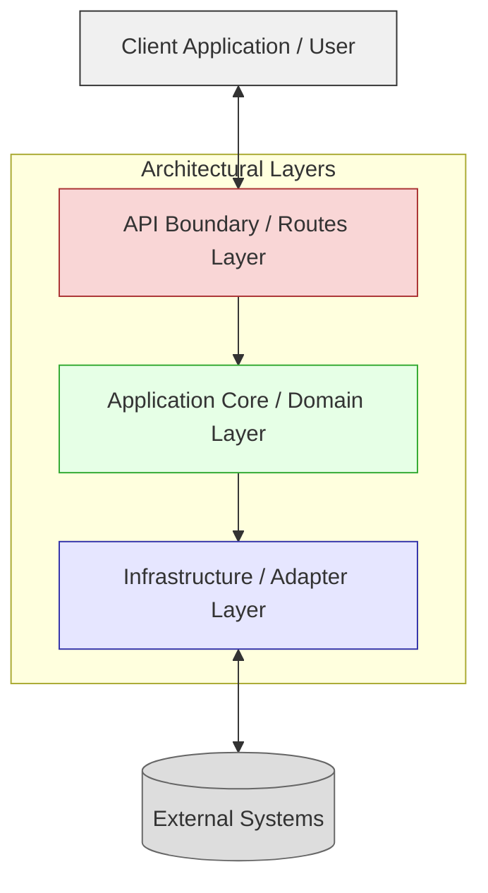
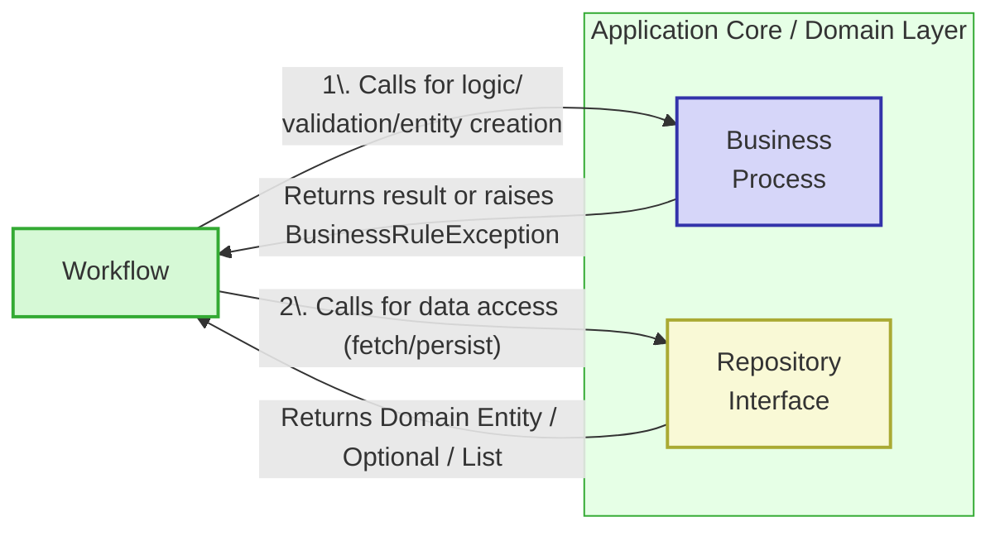
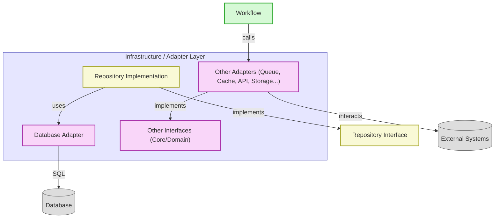
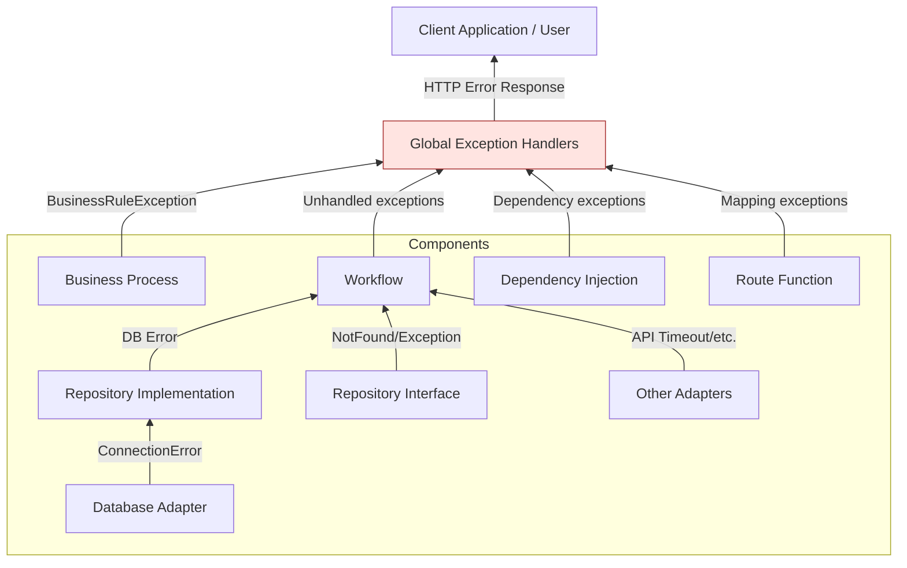

# Application Architecture Guide (v2.2)

## 1. Introduction & Philosophy

This guide defines the architectural standards for building our backend API applications. Our core philosophy balances **development velocity** with **long-term application health**, ensuring we can build quickly while creating systems that are maintainable, testable, and performant.

**Guiding Principles:**

1.  **Simplicity First:** Avoid complexity unless necessary and justified. Start with the simplest solution that works and evolve iteratively.
2.  **Pragmatism over Hype:** Favor proven, "boring" technologies with strong ecosystems. New tech requires focused PoCs and ADRs (Architecture Decision Records) before adoption.
3.  **Performance is Non-Negotiable:** Applications must be responsive ("snappy"). Performance is considered from design through deployment. Optimize application code and database interactions first.
4.  **Evolutionary Design:** Build systems that can adapt. Our chosen architecture facilitates future changes, like decomposing modules into services, without mandating premature distribution.
5.  **Testability is Foundational:** Design for ease of testing at all levels (unit, integration, API/E2E). Our architecture explicitly supports this.
6.  **Consistency is Key:** Adherence to the defined structure, patterns, and naming conventions is crucial for predictability and maintainability.
7.  **Clear Separation of Concerns (SoC):** Different parts of the application have distinct responsibilities, minimizing coupling and maximizing cohesion.
8.  **Dependency Inversion:** High-level modules depend on abstractions (interfaces), not concrete implementations, promoting flexibility.
9.  **Integrated Documentation:** Documentation (`/docs`) lives with the code, is versioned, uses practical diagrams (Mermaid), and includes ADRs for significant decisions or deviations.

## 2. Core Architecture: Modular Monolith

-   **Definition:** A single deployment unit (monolith) internally structured into distinct, well-encapsulated modules. Each module ideally represents a specific business capability or domain (e.g., `employees`, `timesheets`, `invoices`).
-   **Rationale:**
    *   Maximizes initial development speed (reduced distributed systems overhead: network latency, deployment complexity, distributed transactions).
    *   Simplifies initial operations, monitoring, and local development setup.
    *   Allows easy code sharing via internal libraries/core modules.
    *   Provides flexibility: Well-defined module boundaries and interfaces allow for future extraction into separate services if driven by concrete needs (e.g., team structure, independent scaling requirements, differing technology needs). This extraction is facilitated by the clear internal architecture.
-   **Key Characteristics:**
    *   **High Cohesion:** Components within a module are strongly related.
    *   **Low Coupling:** Modules minimize dependencies on each other, interacting through well-defined interfaces (API Layers, Workflow Layers, potentially shared libraries).

## 3. Architecture Choice: Modular Monolith vs. Microservices

A common alternative architecture is Microservices, where the application is decomposed into multiple independently deployable services, each managing its own data and communicating over a network. While powerful for large, complex systems with independent scaling needs, we have deliberately chosen the **Modular Monolith** approach for our standard architecture.

**3.1. Comparison:**

| Feature                 | Modular Monolith (Our Approach)                                    | Microservices Architecture                                      |
| :---------------------- | :----------------------------------------------------------------- | :-------------------------------------------------------------- |
| **Deployment Unit**     | Single Application                                                 | Multiple Independent Services                                   |
| **Codebase**            | Single Repository (typically)                                      | Multiple Repositories (typically)                               |
| **Data Management**     | Single Database (typically, with schemas per module)               | Each service owns its own database/schema                     |
| **Communication**       | Internal Function/Method Calls                                     | Network Calls (REST, gRPC, Messaging Queues)                  |
| **Transactions**        | Local DB Transactions                                              | Distributed Transactions (complex: Sagas, 2PC - often avoided) |
| **Initial Complexity**  | **Lower** (less infrastructure overhead, simpler local dev)        | **Higher** (requires robust CI/CD, service discovery, IPC)     |
| **Operational Overhead**| **Lower** (fewer moving parts to monitor, deploy, manage)         | **Higher** (monitoring, logging, tracing across services)       |
| **Development Velocity**| **Higher Initially** (less coordination, simpler changes)          | Can be higher *at scale* with independent teams, but slower start |
| **Scalability**         | Scale the entire monolith; DB can be bottleneck                  | Scale individual services independently                         |
| **Technology Diversity**| Limited (single stack usually)                                   | High (each service can use different tech - a benefit & cost) |
| **Fault Isolation**     | Lower (error in one module *can* affect others)                    | Higher (failure in one service less likely to cascade directly) |
| **Team Structure**      | Suited for smaller/medium teams or teams working cross-functionally| Suited for larger orgs with teams aligned to specific services |

**3.2. Rationale for Choosing Modular Monolith:**

Based on our guiding principles (**Simplicity First, Pragmatism**) and typical project scope, the Modular Monolith offers significant advantages, particularly in the early-to-mid stages of an application's lifecycle:

1.  **Reduced Initial Complexity:** Avoids the significant upfront investment in infrastructure and tooling required for a robust microservices environment (service discovery, distributed tracing, complex deployment pipelines, inter-service communication patterns).
2.  **Faster Initial Development:** Direct method calls are simpler and faster than implementing and managing network communication. Refactoring across module boundaries within the monolith is easier than coordinating changes across separate service APIs.
3.  **Simplified Operations:** Monitoring, logging, deployment, and local development setup are considerably simpler with a single application unit and database.
4.  **Easier Transaction Management:** Standard atomic database transactions handle data consistency within the monolith, avoiding the complexity of distributed transaction patterns needed in microservices.
5.  **Sufficient Scalability (Initially):** For many applications, scaling the monolith vertically (more CPU/RAM) or horizontally (multiple instances behind a load balancer) alongside standard database scaling techniques provides adequate performance for a long time. Performance bottlenecks are often in specific modules or database interactions, which can be optimized within the monolith structure.

**3.3. Evolution Path to Microservices (When Needed):**

Our **Layered Architecture** and **Modular Monolith** approach are explicitly designed to *facilitate* future decomposition into microservices *if and when concrete needs arise*. It does **not** preclude moving to microservices; it simply avoids the *premature* cost and complexity.

**How this architecture enables the transition:**

1.  **Well-Defined Module Boundaries:** The internal structure, organized by business capability provides natural seams for extraction.
2.  **Clear Interfaces (Workflow Layer):** The methods defined in the Workflow Layer often serve as the basis for the API contract of a potential new microservice.
3.  **Repository Pattern:** Each module accesses data via its own repository interface. When extracting a service, that service takes ownership of its corresponding database tables/schema and its repository implementation.
4.  **Decoupling via Adapters:** Interactions with external systems are already encapsulated in adapters.

**The Process (Conceptual):**

1.  **Identify Candidate Module:** Based on specific drivers (scaling, team structure, tech needs). Requires an **ADR**.
2.  **Define Service API:** Use Workflow methods as a starting point.
3.  **Extract Code:** Move relevant layers for the module to a new project.
4.  **Data Migration/Isolation:** Isolate or migrate the service's data.
5.  **Replace Internal Calls with Network Calls:** Update callers to use the new service's API via an Adapter.
6.  **Deployment:** Deploy independently.
7.  **Consider Patterns:** Use Strangler Fig for gradual migration if needed.

By starting with a well-structured Modular Monolith, we gain initial velocity and simplicity while keeping the door open for a transition to microservices driven by real needs.

## 4. Layered Architecture - The Core Pattern

To ensure Separation of Concerns, Testability, and Maintainability, all backend implementations **MUST** follow this five-layer architecture pattern.

**4.1. High-Level Overview:**

This diagram shows the main layers and their dependencies:



**4.2. The Five Layers Defined:**

1.  **Routes Layer (`app/api/routes/`)**
    *   **Purpose:** Handles incoming HTTP requests and outgoing HTTP responses. Acts as the interface to the outside world.
    *   **Responsibilities:** Define endpoints, validate/serialize schemas (`app/schemas/`), handle auth, use DI (`app/api/deps.py`) to get a **Workflow**, call a *single* Workflow method, map results to response schemas. **NO business/orchestration logic.**

2.  **Workflow Layer (`app/domain/workflows/`)**
    *   **Purpose:** Orchestrates application use cases. Defines *how* the application achieves a goal. Coordinates domain logic and infrastructure access.
    *   **Responsibilities:** Define use case methods, inject & call **Business Process** components (for logic), **Repository Interfaces** (for data), and **Adapter Interfaces** (for external systems/tasks). May call other Workflows. Manages transactions. Contains **Application Logic**, NOT core **Domain Logic**. Raises application exceptions. Returns results (e.g., Domain Entities) to Routes.

3.  **Business Process Layer (`app/domain/business_process/`)**
    *   **Purpose:** Encapsulates pure, domain-specific business logic, rules, calculations, and validations.
    *   **Responsibilities:** Contain core business rules, operate on Domain Entities (`app/domain/entities/`). Perform complex validations. **MUST NOT contain I/O.** **MUST NOT depend on Repositories/Adapters.** Raise `BusinessRuleException`. Return results to Workflow. Highly testable and reusable.

4.  **Repository Layer (Interface) (`app/domain/interfaces/`)**
    *   **Purpose:** Defines the contract (interface) for data access operations for a specific Domain Entity or aggregate. Abstracts *how* data is persisted/retrieved.
    *   **Responsibilities:** Define ABCs (e.g., `EmployeeRepository`). Define `async` data operation methods (e.g., `create`, `get_by_id`). Accept/return Domain Entities or primitives. **MUST NOT expose storage details.**

5.  **Adapter Layer (`app/infrastructure/`)**
    *   **Purpose:** Provides concrete implementations for interfaces. Handles all external system interactions.
    *   **Responsibilities:**
        *   **Repository Implementations (`app/infrastructure/repositories/`)**: Implement Repository interfaces (e.g., `SQLEmployeeRepository`). Use `DatabaseAdapter`. Translate domain ops to infrastructure actions (e.g., **parameterized SQL**). Map data between Entities and infrastructure format. Handle infrastructure errors. **ONLY data mapping & infra logic.**
        *   **Infrastructure Adapters (`app/infrastructure/adapters/`)**: Implement interfaces (`DatabaseAdapter`, `CacheAdapter`, etc.). Encapsulate driver/SDK/client details (`asyncpg`, `boto3`, `httpx`, etc.). Manage connections, auth, serialization.

**4.3. Interaction Flow & Rationale:**

This diagram illustrates the primary flow:



*   **Key Interaction:** Workflow orchestrates, calling BP for pure logic and Repository Interfaces for data ops.
*   **Rationale (BP Purity):** Keeps BP free from I/O, making it highly testable and reusable.
*   **Application vs. Domain Logic:** Workflow handles use case orchestration; BP handles core domain rules.

**4.4. Handling External Systems:**

Accessed via Adapters, typically called by the Workflow Layer.



*   Define Interface (`app/core/interfaces.py` or `app/domain/interfaces/`).
*   Implement Adapter (`app/infrastructure/adapters/`) using specific libraries.
*   Inject Interface into Workflow.

## 5. Data Handling: Entities & Schemas

*   **Domain Entities (`app/domain/entities/`)**: Represent core business concepts (e.g., `Employee`). Typically `dataclasses` or Pydantic `BaseModel`s. Used internally by Workflow, BP, Repo layers. **Not exposed by API.** Use `_entity.py` suffix, simple class names (e.g., `class Employee:`).
*   **API Schemas (`app/schemas/`)**: Define API request/response contracts. **MUST** use Pydantic `BaseModel`. Use Python `Enum`s. **ONLY used in Routes Layer** for validation/serialization. Map Entities <-> Schemas explicitly in Routes. Use names like `EmployeeCreateSchema`, `EmployeeReadSchema`.

## 6. Data Persistence: Repository Pattern & Direct SQL

*   **Repository Pattern:** All data access **MUST** go through Repository Interfaces (`app/domain/interfaces/`). Implementations (`app/infrastructure/repositories/`) use the `DatabaseAdapter`.
*   **Database Adapter (`app/infrastructure/adapters/db/postgres.py`):** Handles `asyncpg` connection pooling, query execution (`fetch_one`, `fetch_all`, `execute`), and transactions.

**6.1. Rationale for Direct SQL over ORM:**

While Object-Relational Mappers (ORMs) like SQLAlchemy or Tortoise ORM are common in the Python ecosystem, this specification standardizes on **direct SQL execution via `asyncpg`**. This is a deliberate choice driven by our core principles:

1.  **Performance Control (Principle #3):** Direct SQL provides maximum transparency and control over database interactions. We can write highly optimized queries tailored to specific use cases and leverage advanced PostgreSQL features without battling potential ORM overhead or unpredictable query generation. Performance is non-negotiable, and direct access gives us the tools to ensure it.
2.  **Leveraging Database Features:** Allows direct use of PostgreSQL-specific features (JSONB operators, extensions like PostGIS, window functions, CTEs) without waiting for ORM support or working around ORM limitations.
3.  **Avoiding ORM Impedance Mismatch:** Prevents complexities that can arise when mapping object-oriented paradigms to relational databases (e.g., lazy loading issues (N+1 problems), complex relationship management, identity map challenges).
4.  **Conceptual Simplicity (within this architecture):** While writing SQL requires effort, it avoids adding another layer of abstraction (the ORM) and its associated configuration, session management, and potential magic. Our layered architecture already provides abstraction via the Repository pattern.

**Mitigating the Downsides:**

*   **SQL Skill Requirement:** We acknowledge this requires developers to be proficient in writing safe, efficient SQL. This is addressed through code reviews, potential team training, and shared best practices (see Supporting Principles).
*   **Boilerplate:** Writing basic CRUD SQL can be repetitive. This is mitigated by:
    *   Using the **Repository Pattern** to encapsulate queries.
    *   Potential use of **code generation tools** (like Cookiecutter, see Section 12) to scaffold basic repository implementations.
    *   Focusing custom SQL effort on complex queries where it provides the most value.
*   **Security (SQL Injection):** This risk is explicitly addressed by the **MANDATORY use of Parameterized Queries** via `asyncpg`'s `$1, $2...` placeholders. String formatting/interpolation for query values is strictly forbidden.

This choice aligns with our "Pragmatism over Hype" and "Performance is Non-Negotiable" principles. Using an ORM would require justification via an **ADR**.

## 7. Error Handling

*   **Custom Exceptions:** Define specific exceptions (`app/core/exceptions.py`) inheriting from `ApplicationException`. Lower layers raise these.
*   **Exception Propagation:** Exceptions generally propagate upwards.
*   **Global Exception Handlers:** Primary mechanism (`app/api/error_handlers.py`, registered in `app/main.py`) to catch application exceptions and translate them into appropriate HTTP `JSONResponse` errors (status codes, details).
*   **Router Responsibility:** Routers ideally rely on global handlers, avoiding complex `try...except` blocks for application errors.



## 8. Technology Stack (Primary)

*   **Language:** Python 3.11+
*   **Framework:** FastAPI
*   **ASGI Server:** Uvicorn (Dev) / Gunicorn + Uvicorn workers (Prod)
*   **Data Validation/Serialization:** Pydantic v2
*   **Database:** PostgreSQL (Latest Stable)
*   **DB Driver:** `asyncpg` (Direct SQL via `DatabaseAdapter` only)
*   **DI:** FastAPI `Depends`
*   **Testing:** `pytest`, `pytest-asyncio`, FastAPI `TestClient`, `httpx`, `pytest-cov`, `factory-boy`
*   **Dependency Mgmt:** Poetry
*   **Lint/Format:** Black, Flake8 (+ plugins like bugbear, comprehensions), isort, MyPy
*   **Hooks:** `pre-commit` enforcing linters/formatters.
*   **Async:** All I/O operations (DB, external APIs, etc.) **MUST** be `async`/`await`.

*(Alternative stacks like Node.js/TypeScript/Fastify exist but require adherence to the same 5-layer principles and direct SQL access, justified via ADR).*

## 9. Code Structure & Naming Conventions

**9.1. Canonical Directory Structure (Root Level):**

```
.
├── app/
│   ├── api/
│   │   ├── deps.py
│   │   ├── error_handlers.py
│   │   └── routes/
│   │       └── __init__.py # + employee_router.py, etc.
│   ├── core/
│   │   ├── config.py
│   │   ├── exceptions.py
│   │   └── interfaces.py # Core adapter interfaces (DatabaseAdapter, etc)
│   ├── domain/
│   │   ├── business_process/
│   │   │   └── __init__.py # + employee_bp.py, etc.
│   │   ├── entities/
│   │   │   └── __init__.py # + employee_entity.py, etc.
│   │   ├── interfaces/
│   │   │   └── __init__.py # + employee_repository.py, etc. (Repo ABCs)
│   │   └── workflows/
│   │       └── __init__.py # + employee_workflow.py, etc.
│   ├── infrastructure/
│   │   ├── adapters/
│   │   │   ├── db/
│   │   │   │   └── postgres.py
│   │   │   ├── cache/
│   │   │   └── queues/ # etc.
│   │   └── repositories/
│   │       └── __init__.py # + sql_employee_repository.py, etc.
│   ├── schemas/
│   │   └── __init__.py # + employee_schema.py, etc.
│   └── main.py
├── docs/
│   ├── adrs/
│   ├── diagrams/
│   └── ...
├── scripts/
│   └── sql/ # For manual schema scripts
├── tests/
│   ├── api/
│   ├── factories/
│   ├── integration/
│   │   └── infrastructure/
│   │       └── repositories/
│   └── unit/
│       ├── core/
│       └── domain/
│           ├── business_process/
│           └── workflows/
├── .env.example
├── .gitignore
├── .pre-commit-config.yaml
├── pyproject.toml
├── poetry.lock
└── README.md
```

**9.2. Naming Conventions:**

*   **Files/Dirs:** `snake_case`
*   **Classes/Interfaces/Enums:** `PascalCase`
    *   Workflow: `EmployeeWorkflow`
    *   Business Process: `EmployeeBusinessProcess`
    *   Repo Interface: `EmployeeRepository` (ABC)
    *   Repo Impl: `SQLEmployeeRepository`
    *   Adapter: `PostgresAdapter`, `S3StorageAdapter`
    *   Entity: `Employee` (simple name)
    *   Schema: `EmployeeCreateSchema`, `EmployeeReadSchema`, `EmploymentStatusEnum`
    *   Exception: `NotFoundException`
*   **Methods/Functions/Variables:** `snake_case`
*   **Filename Suffixes:** `_router.py`, `_workflow.py`, `_bp.py`, `_repository.py` (interface), `sql_..._repository.py` (impl), `_entity.py`, `_schema.py`, `test_... .py`.

## 10. Prescribed TDD Workflow

Development **MUST** follow this Test-Driven Development cycle for features involving multiple layers:

1.  **API Test (Fail):** Write `test_..._router.py` using `TestClient`. Test success (2xx, response schema) and key error cases (4xx). Fails (404/500).
2.  **Route Implementation (Minimal):** Create route (`..._router.py`), define schemas (`..._schema.py`), inject Workflow (`deps.py`), call placeholder workflow method. Fails (DI/NotImplemented).
3.  **Workflow Unit Test (Fail):** Create `test_..._workflow.py`. Mock Repo Interface & BP class. Test workflow logic, asserting mocks are called correctly. Fails (NotImplemented).
4.  **Workflow Implementation:** Implement workflow logic (`..._workflow.py`), calling mockable BP/Repo interface methods. Pass workflow unit tests. API test likely still fails (DI/Repo Impl).
5.  **Business Process Unit Test (Fail - if new logic):** Create `test_..._bp.py`. Test pure domain logic/validation without mocks. Fails (NotImplemented).
6.  **Business Process Implementation:** Implement BP logic (`..._bp.py`). Pass BP unit tests.
7.  **Repository Integration Test (Fail):** Create `test_sql_..._repository.py`. Use a real test DB fixture (`test_db_session`). Instantiate SQL Repo Impl with test adapter. Call repo method. Assert entity state and query DB directly to verify persistence/retrieval. Fails (NotImplemented/DB error).
8.  **Repository Implementation:** Implement SQL Repo method (`sql_..._repository.py`) using `DatabaseAdapter` and parameterized SQL. Implement `_map_row_to_entity`. Pass repo integration tests.
9.  **Wire Dependencies:** Ensure `deps.py` correctly provides the concrete implementations (SQL Repo, BP) when injecting interfaces (Repo Interface) into the Workflow.
10. **Run API Test (Pass):** Re-run initial API test. It must pass, exercising the full stack.
11. **Refactor:** Clean up code and tests while keeping all tests passing.

## 11. Supporting Principles (Briefly)

*   **Performance:** Prioritize efficient `async` code, database query tuning (`EXPLAIN ANALYZE`), appropriate indexing. Use application-level caching cautiously *after* optimizing code/DB.
*   **Security:** Use Pydantic for input validation. **MANDATORY Parameterized Queries** are the primary defense against SQL Injection. Use standard JWT/OAuth2 via Adapters. Scan dependencies. Manage secrets via env vars (`.env`) and secure secret stores in deployment. Enforce HTTPS. Implement rate limiting.
*   **Deployment:** Target Docker containers. Use Environment Variables exclusively for configuration (loaded via `pydantic-settings`).
*   **Dev Process:** Use Git (GitHub Flow recommended), mandatory PRs/Code Reviews, `pre-commit` hooks for local checks, CI/CD pipeline for automated testing/builds/deployments.
*   **Documentation:** Maintain living documentation in `/docs` (incl. ADRs for deviations), use Mermaid diagrams.

## 12. Evolution Strategy

The Modular Monolith structure and clear layering facilitate future evolution. If a module needs to be extracted into a separate service (due to scaling needs, team structure, etc.), the Workflow Layer often defines the initial contract/API boundary for the new service. Avoid premature decomposition (see Section 3.3 for more details).
